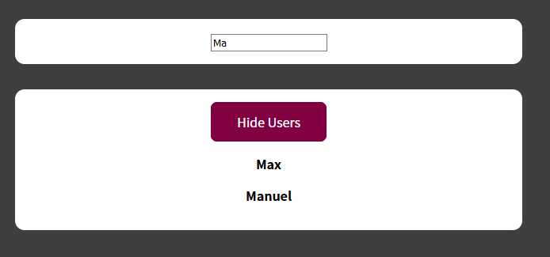

# react-course-webapp-7
*Section 13: An Alternative Way Of Building Components: Class-based Components*




- Class based components
- Error boundaries

Filtreringsapp som kaster ny error hvis man søker etter noe som ikke finnes. Error boundary component fanger erroren slik at den ikke krasjer hele appen. Dvs. i development må man krysse ut erroren først.

## local setup
```
npm install
npm start
```